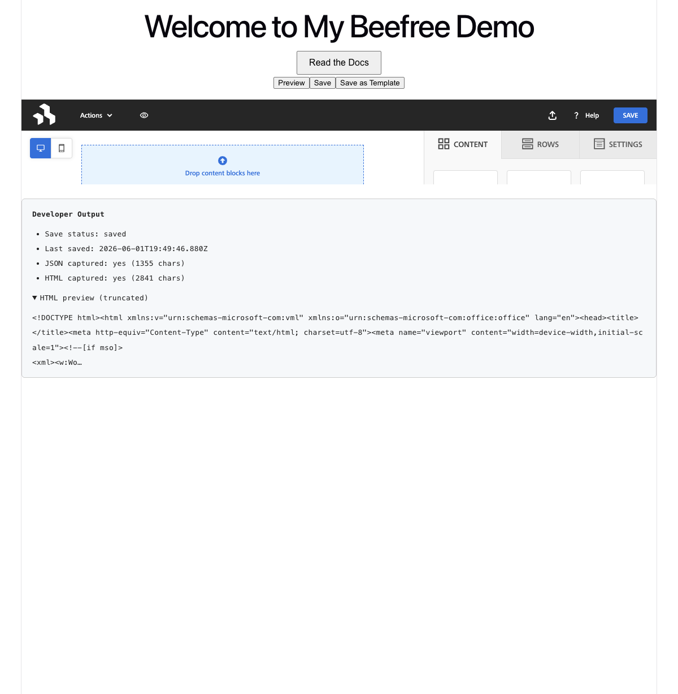
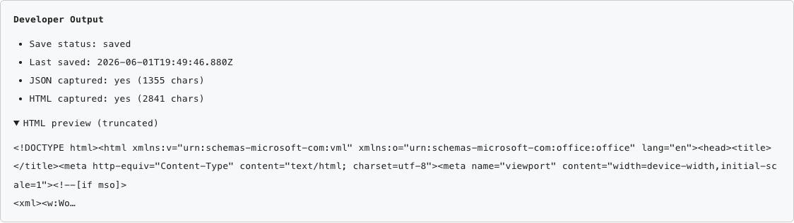

# My Email Builder — Beefree SDK + React

Meet the beefree email builder using the [Beefree SDK](https://docs.beefree.io/beefree-sdk) email builder! This current implementation is in React (Vite + TypeScript), however, we offer many other compeling flavors (Angular, Vue, and Django! INSERT_DOCS_LINK_HERE). This app has a secure backend proxy for authentication and a developer-facing output panel that captures the editor's save results. Feel free to clone it as a launching point or use it to reference/debug your own applications!



## Feature set

- **Embedded drag-and-drop email builder** — the official `Builder` component renders the full Beefree editor (content blocks, rows, settings) inside the app.
  - Implemented in `src/BeefreeEditor.tsx` (config at lines 23–29, `Builder` rendered at lines 93–102).
  - Docs: [React No-code Email Builder quickstart](https://docs.beefree.io/beefree-sdk/quickstart-guides/react-no-code-email-builder)

- **Secure `/loginV2` auth via a proxy** — `client_id` / `client_secret` stay server-side; the browser only ever receives a short-lived token.
  - Implemented in `proxy-server.js` (endpoint at lines 17–35) and `src/BeefreeEditor.tsx` (token fetch at lines 49–60).
  - Docs: [Authorization Process (server-side `/loginV2`)](https://docs.beefree.io/beefree-sdk/getting-started/readme/installation/authorization-process-in-detail)

- **Programmatic control** — `useBuilder` exposes `save`, `preview`, `saveAsTemplate`, etc., wired to the toolbar buttons.
  - Implemented in `src/BeefreeEditor.tsx` (`useBuilder` at line 29, `handleSave` at lines 31–47, toolbar buttons at lines 87–92).
  - Implemented in `src/BeefreeEditor.tsx` (`onSave` capture at lines 62–71, `DeveloperOutput` component at lines 122–164).
  - Docs: [Methods and Events](https://docs.beefree.io/beefree-sdk/getting-started/readme/installation/methods-and-events)

- **Lightweight error handling** — guards against an un-started editor and surfaces SDK errors in the panel.
  - Implemented in `src/BeefreeEditor.tsx` (un-started guard at lines 33–37, `onError` at lines 77–81).
  - Docs: [Warning, Error, and Info Callbacks (`onError`)](https://docs.beefree.io/beefree-sdk/resources/error-management/warning-error-info-callbacks)

### Developer Output panel

Clicking **Save** triggers the documented Beefree save flow; the `onSave` callback hands back both the design JSON and the rendered HTML, which the panel captures and reports:



## How it fits together (key files)

A few of the bigger pieces, with exact locations, to orient new contributors:

| Concern | Where | What it does |
| --- | --- | --- |
| Auth proxy | `proxy-server.js` (lines 17–35) | `POST /proxy/bee-auth` forwards `uid` + server-side credentials to `https://auth.getbee.io/loginV2` and returns the token. |
| Fetch token | `src/BeefreeEditor.tsx` (lines 49–60) | On mount, calls the proxy and stores the returned token in state. |
| Initialize builder | `src/BeefreeEditor.tsx` (line 29, render at lines 93–102) | `useBuilder(config)` provides the instance `id` + control methods; the `Builder` component is rendered with `id`, `token`, and `template`. |
| Capture save output | `src/BeefreeEditor.tsx` (lines 62–71) | `onSave(pageJson, pageHtml)` stores JSON, HTML, timestamp, and status — the core of the feature. |
| Output panel UI | `src/BeefreeEditor.tsx` (lines 122–164) | The `DeveloperOutput` component renders status, captured-data summary, and a truncated HTML snippet. |
| StrictMode note | `src/main.tsx` | `React.StrictMode` is intentionally omitted; its dev double-invoke races the SDK's imperative lifecycle and throws `Bee is not started`. |

## Getting started

### 1. Credentials

Create `.env` in the project root (already gitignored):

```
BEE_CLIENT_ID='YOUR-CLIENT-ID'
BEE_CLIENT_SECRET='YOUR-CLIENT-SECRET'
```

Get these from the [Beefree Developer Console](https://developers.beefree.io/login?from=website_menu) — see the [create-an-application guide](https://docs.beefree.io/beefree-sdk/getting-started/readme/create-an-application).

### 2. Install & run

```bash
npm install
npm start
```

`npm start` runs the proxy (`http://localhost:3001`) and the Vite dev server (`http://localhost:5173`) concurrently. Open the Vite URL, then use **Save** to populate the Developer Output panel.

## Next steps + Further Learnings

- **Persist the output**: POST the captured `pageJson` (source of truth) and `pageHtml` to a backend to store templates per user.
- **Server-side rendering/export**: for AMP, PDF, or re-rendering HTML from stored JSON, integrate the Beefree **Content Services API** (not needed today, since `onSave` already returns HTML).
- **HTML import**: to migrate existing email templates in, use the [HTML Importer API](https://docs.beefree.io/beefree-sdk).
